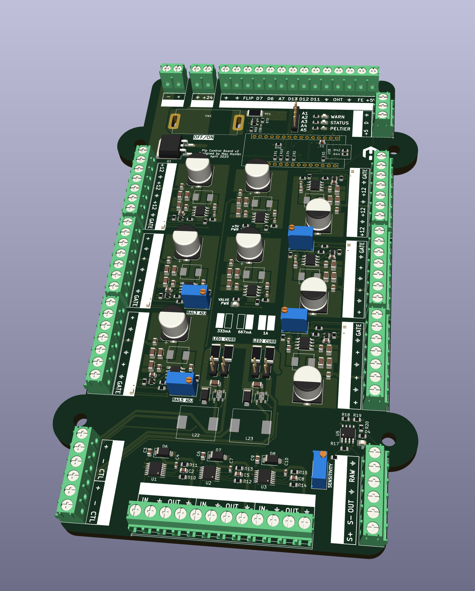
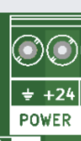
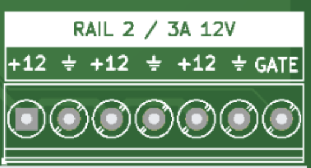
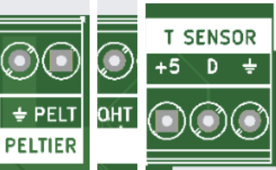
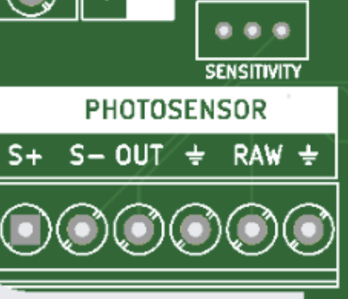
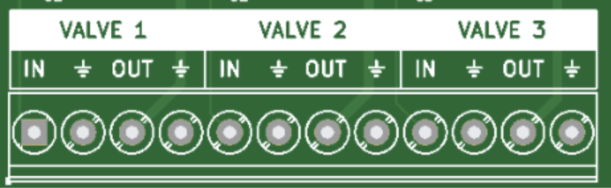
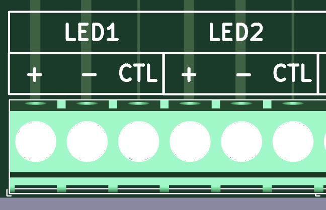
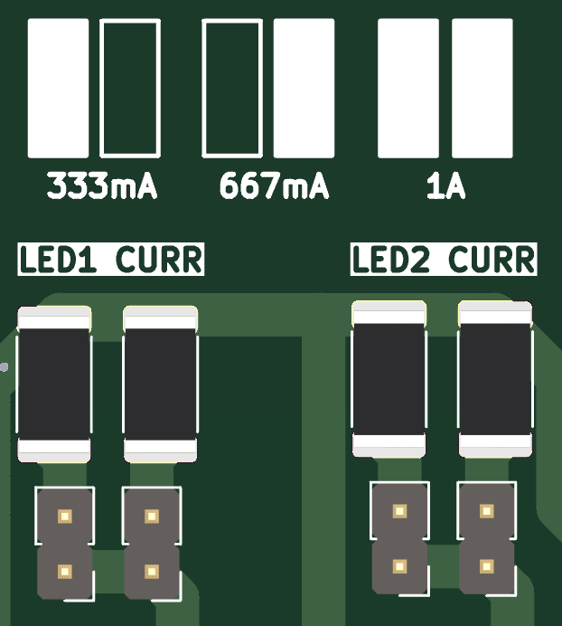
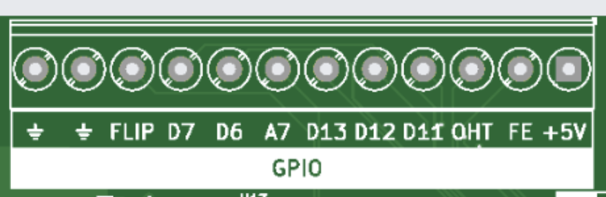

## PipCB v2 assembly and usage instructions

### Max Hunter, March 2024

Thanks for purchasing a PipCB! This guide should act as a basic how-to to get started.

A purchasable Bill of Materials, all source code for the Arduino, and electronics design files can be found in this repository.

The board comes with a one-year warranty against manufacturing defects.

If you have any further questions or have any problems, please leave an issue on this GitHub repository.

## General notes

This board was designed by [Max Hunter](https://maxhunter.me/), to the specifications of Philip Coen. It  is designed both with features that are universally applicable to experimental neuroscience rigs, as well as some features which may not (but may) be useful outside the Coen Lab. In particular, the entire board costs less than the commercial equivalent of some single features (e.g. constant current delivery, or a thresholded, adjustable photodiode circuit).

The board as sold comprises:

- 24V, 220W power supply
- Photodiode (2-pin)
- Temperature sensor (3-pin)
- Enclosure
- ECB Version 2 with the following features
    - Temperature-controlled PID Peltier cooler output with overheat protection
    - Two fixed 12V, 3A power rails for auxiliary devices, with switchable on/off outputs
    - Four variable 3-24V, 3A power rails for auxiliary devices, with switchable on/off outputs
    - Two adjustable 0-1A continuous current drivers for LEDs or similar devices
    - Photosensor with variable sensitivity trigger (5V TTL digital output)
    - Three DRV104 valve controllers, 12V output
    - One Arduino Nano V3, used to control Peltier output and random ‘flipper’ output, with 6 spare IO for future expansion

Please take the following precautions when handling the board.

* **At no point should you “hot-plug” / screw or unscrew anything into the board when it is powered on. The rapid transients caused by the making/breaking of contacts when screwing a cable in can damage the board as well as any attached components.**
* Do not overload or short-circuit any of the power rails.
* Please pay attention to the total maximum current rating of 220W, which is possible to exceed if fully loading all voltage rails.
* When handling or touching any components on the board, you should ground yourself with an ESD bracelet (£4 on Amazon) or by touching any grounded surface to dissipate electrostatic charge. Humans can accumulate several thousand volts of static charge which will dissipate through the board: several of the components on the board are very sensitive to ESD. When screwing in any of the terminals, take the same precaution, or use an insulated screwdriver so your skin does not make contact with the screw of the terminal.

## Installation/operation instructions

### General notes on screw terminals

All the external connections to the board are made using screw terminals. These accept a wide variety of wire sizes. You should strip 5mm off the wire, then unscrew the terminal until the jaws fully open, insert the wire, and hand-tighten. The screw should clamp down on the conductor (not the insulation) and no conductor should be visible out the end of the connector.

For low-power devices with small cable sizes it is acceptable to insert several wires into a single terminal, as long as they are all sufficiently stripped so that they are making good contact with the terminal.

### Case

Four self-tapping screws can be inserted into the four corners of the case in the pre-drilled holes to mount onto any suitable surface. The board can be installed in any orientation but preferably should be kept away from direct sunlight and heat sources.

### Power in

The board comes with a switchmode 24V, 220W power supply. You should sum up all the current ratings of the various attached devices (including Peltier cooler) and make sure they do not exceed 220W.

Once in the correct position, the insulation on the power connector should be cut off and the ends stripped to 5mm. Slightly twist the copper to make sure no strands splay off, then insert BLACK into ⏚ and RED into +24.

### Power out

There are 6 power rails for auxiliary devices on this board. All of them share the same 3A current rating.

RAIL 1: 12V fixed

RAIL 2: 12V fixed

RAIL 3: Variable 3-23V

RAIL 4: Variable 3-23V

RAIL 5: Variable 3-23V

RAIL 6: Variable 3-23V

RAIL 3-6 are adjustable by turning the potentiometers next to the relevant rails with a small insulated flat screwdriver, whilst metering the output voltage with the serial logger on the Arduino, or a multimeter. Care should be taken to make sure the screwdriver does not slip and you do not touch any other components while metering, especially if using a multimeter.

All rails have a GATE input. Leaving this pin disconnected, or connecting this to a voltage below approximately 1.3 V, turns the regulator on, and pulling this pin above 1.3 V (up to a maximum of 25 V) shuts the regulator down. This is a useful feature if you wish to use an Arduino pin (or other logic pin) to switch power to an external component. (Note that there are output capacitors on the voltage rails so the power will not switch off instantly)

### Peltier

This board is tested and designed to work with the following 24V, 60W Peltier cooling module: [https://uk.rs-online.com/web/p/heat-pumps/7777079](https://uk.rs-online.com/web/p/heat-pumps/7777079). Other modules may work, as long as they are 24V and do not exceed 8A.

Insert BLACK into ⏚ and RED into PELT.

Connect overheat switch to any terminal marked ⏚ and OHT (polarity doesn’t matter). This is a NC (normally closed) design which opens if the Peltier overheats - if your Peltier unit does not have an overheat sensor you should either modify the Arduino code or put a small bit of wire between OHT and ⏚ to bypass it.

The temperature sensor (mandatory for Peltier cooling) should be plugged into T SENSOR. Red into +5, yellow into D (data), black into ⏚. It should be positioned close to/underneath the desired position to be kept at a constant temperature.

The two fans (if available) should be plugged into any +12V rail.

The code for the Peltier follows a PID loop with a frequency of approximately 800KHz. It is roughly tuned for Pip’s original experimental box and so the P, I, D constants may need adjusting if the temperature proves to oscillate or under/overshoot in a new environment or with a different Peltier.

### Photodiode

This is a completely separate module from the rest of the board, designed as an adjustable photodiode trigger at a user-settable light threshold - originally designed to be placed next to a square on a screen to synchronise it with experimental data. This turns a variable light level into a digital 5V TTL logic output. There is a Schmitt trigger to remove hysteresis. The included photodiode (optional) should be plugged with the RED wire into S- and the BLUE wire into S+. The photodiode should be placed in the desired position and the potentiometer adjusted for the desired sensitivity.

The output between OUT and ⏚ is the 5V TTL out. The output between RAW and ⏚ is designed as an ‘analogue backup’ in case the sensitivity is slightly wrong - it is an analogue voltage (controlled by the SENSITIVITY  knob) before the Schmitt comparator where 2.5V is approximately the midpoint threshold.

### Valve drivers

These are 3 completely independent valve drivers. They take 5V TTL logic in (between IN and ⏚) and connect to a valve. The specs are fixed and as follows:

This was designed for the following valve:

225P011-21 ([https://www.nresearch.com/products/valves/pinch-1xnc.html](https://www.nresearch.com/products/valves/pinch-1xnc.html))

When the logic level input goes above approximately 2.2V (maximum 5.5V) the output briefly rises to 12V for 100ms, then continues to pulse between 0V and 12V at a 33% duty cycle until the input voltage drops beneath approximately 1.2V. This keeps the valve open without burning out the solenoid.

### Constant current drivers

There are 2 constant-current drivers on this board. They are adjustable in 3 fixed steps: 333mA, 667mA, 1000mA, by adding or removing jumpers on the board as shown.

They can also be controlled with the CTL pin for the relevant output as follows:

0-2.5V: scales linearly between 0A and the maximum set current (i.e. if the jumpers are set to 1A, setting the CTL pin at 1.25V will output a target current of 500mA).

2.5-5V: fully ON.

This can be used either as analogue control from 0-2.5V, or as a digital on/off switch by modulating the input voltage between 0 and 5V.

There is an internal pull-up resistor, so leaving this pin floating is the same as pulling it up to +5V (ie "on").

### Arduino I/O

This is a breakout board for the included Arduino Nano v3. 

The currently implemented features are:

A ‘flipper’ random I/O which randomly flips between HIGH and LOW approximately every 100ms. This is turned on and off by setting FE (flipper enable) to HIGH or LOW.

An OHT overheat sensor for the Peltier (described in the Peltier section above)

Two ⏚ ground terminals and a 5V logic output. This 5V output is a logic reference only and not to be used for power. Drawing more than 50mA of current through it will result in permanent damage to the board. If there is any chance of it shorting to ground (or any other voltage), a 200 ohm resistor in series with it is strongly recommended.

The other outputs match the Arduino pinout and are reserved for future expansion.

Plugging the board into a computer is optional and only needed if you wish to log temperature/rail voltages etc, or update the firmware.

The firmware is available on GitHub and can be modified and uploaded using the connector on the Arduino. Plugging in the USB-C connector and opening up the serial logger on the Arduino app (or a MATLAB/Python program) will print rail voltages and temperature. You can then use the Arduino app to reflash any firmware changes.

## Manufacturing instructions

### Board

A service like JLCPCB can be used with the included Gerber and pick&place files to manufacture and assemble the board.
